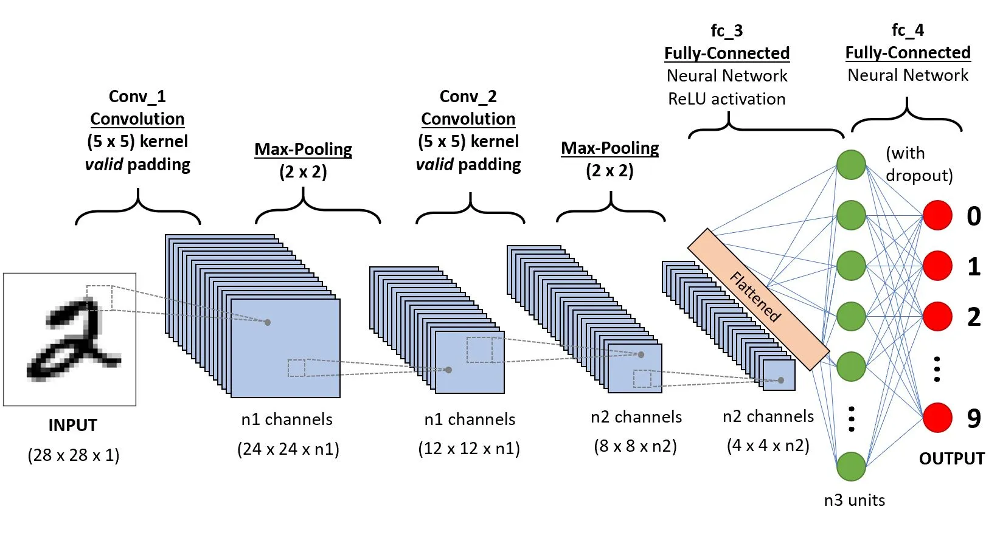
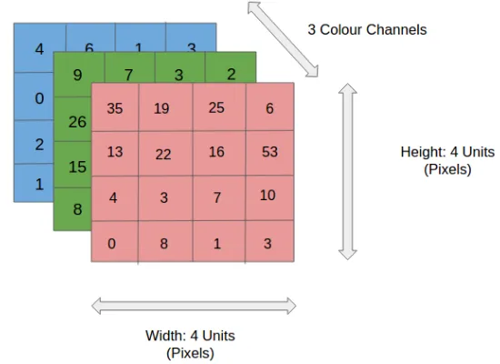
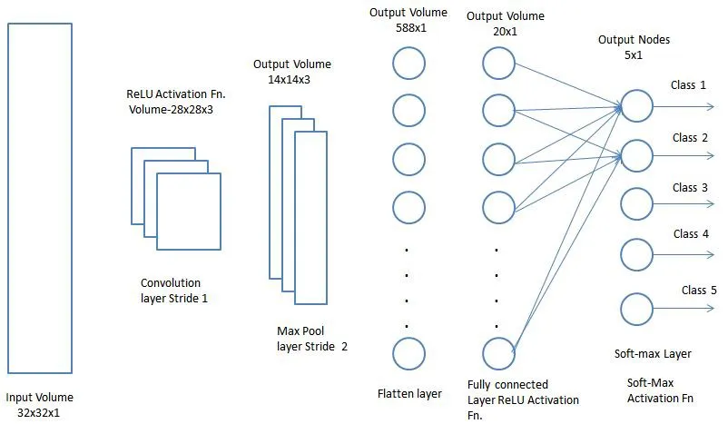
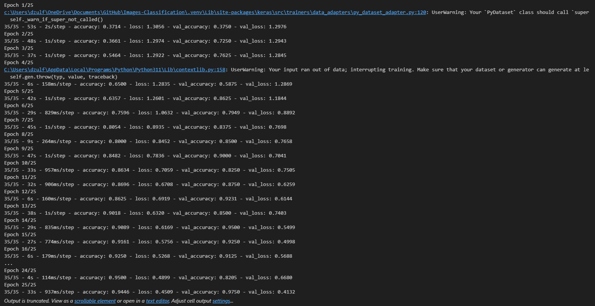
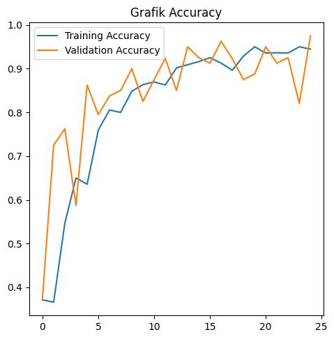
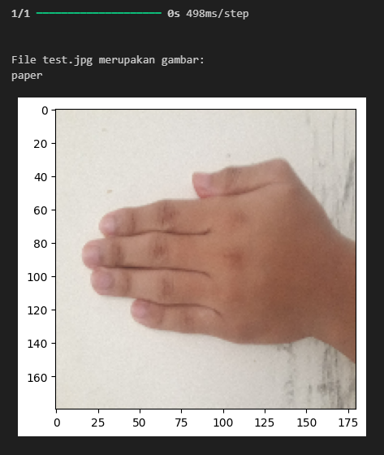

# Image Classification Using Convolutional Neural Network (CNN)

In this project, I create a _state-of-the-art_ python program for classifying rock, paper, and scissor images using a Convolutional Neural Network (CNN). I create this program for completing online learning classes with Dicoding Indonesia. The dataset consists of image human hand images making rock, paper, and scissor hand gestures. I download the rock paper scissor dataset from [here](https://www.kaggle.com/datasets/drgfreeman/rockpaperscissors?resource=download). This program uses TensorFlow to create a Machine Learning model for CNN. First of all, I split the dataset into training and testing with a ratio of 80%: to 20%. The training data is augmented using an image data generator. It increases the diversity of the training dataset by applying random transformations, such as image rotation, flip, translation, scaling, etc.

I use a Convolutional Neural Network (CNN) for the Machine Learning model. I create 4 layers for each convolution layer and pooling layer. I use a convolution layer with the kernel size 3x3 and the relu activation function. I use max pooling in the pooling layer with a window size 2x2. In the next stage, I use 3 dense layers using the relu activation function. I also apply dropout and regulator functions. In the output layer, I use a sigmoid activation function that produces a vector of probabilities for each label. To evaluate the model, I plot the graphic of training and validation accuracy in each step. From the graphic, we know that the model is under-fitting, over-fitting, or best-fitting.

## Convolutional Neural Network (CNN)



A Convolutional Neural Network (ConvNet/CNN) is a Deep Learning algorithm that can take in an input image, assign importance (learnable weights and biases) to various aspects/objects in the image, and be able to differentiate one from the other. The pre-processing required in a ConvNet is much lower as compared to other classification algorithms. The architecture of a ConvNet is analogous to that of the connectivity pattern of Neurons in the Human Brain and was inspired by the organization of the Visual Cortex. Individual neurons respond to stimuli only in a restricted region of the visual field known as the Receptive Field. A collection of such fields overlap to cover the entire visual area.

They have three main types of layers, which are:

- Convolutional layer
- Pooling layer
- Fully-connected (FC) layer

The convolutional layer is the first layer of a convolutional network. While convolutional layers can be followed by additional convolutional layers or pooling layers, the fully-connected layer is the final layer. With each layer, the CNN increases in its complexity, identifying greater portions of the image. Earlier layers focus on simple features, such as colors and edges. As the image data progresses through the layers of the CNN, it starts to recognize larger elements or shapes of the object until it finally identifies the intended object.

### Input Image



In the figure, we have an RGB image that has been separated by its three color planes — Red, Green, and Blue. There are a number of such color spaces in which images exist — Grayscale, RGB, HSV, CMYK, etc. You can imagine how computationally intensive things would get once the images reach dimensions, say 8K (7680×4320). The role of ConvNet is to reduce the images into a form that is easier to process, without losing features that are critical for getting a good prediction.

### Convolutional Layer


The convolutional layer is the core building block of a CNN, and it is where the majority of computation occurs. It requires a few components, which are input data, a filter, and a feature map. Let’s assume that the input will be a color image, which is made up of a matrix of pixels in 3D. This means that the input will have three dimensions—a height, width, and depth—which correspond to RGB in an image. We also have a feature detector, also known as a kernel or a filter, which will move across the receptive fields of the image, checking if the feature is present. This process is known as a convolution.

### Pooling Layer


Pooling layers, also known as downsampling, conducts dimensionality reduction, reducing the number of parameters in the input. Similar to the convolutional layer, the pooling operation sweeps a filter across the entire input, but the difference is that this filter does not have any weights. Instead, the kernel applies an aggregation function to the values within the receptive field, populating the output array. There are two main types of pooling:

- Max pooling: As the filter moves across the input, it selects the pixel with the maximum value to send to the output array. As an aside, this approach tends to be used more often compared to average pooling.
- Average pooling: As the filter moves across the input, it calculates the average value within the receptive field to send to the output array.

### Fully-connected (FC) Layer



Now that we have converted our input image into a suitable form for our Multi-Level Perceptron, we shall flatten the image into a column vector. The flattened output is fed to a feed-forward neural network and backpropagation is applied to every iteration of training. Over a series of epochs, the model is able to distinguish between dominating and certain low-level features in images and classify them using the Softmax Classification technique.

## Result

### Dataset

The dataset is the image of rock paper scissor hand gestures from different physical appearances. The dataset contains a total of 2188 images corresponding to the 'Rock' (726 images), 'Paper' (710 images), and 'Scissors' (752 images). All images are taken on a green background with relatively consistent lighting and white balance. All images are RGB images 300 pixels wide by 200 pixels high in .png format. The images are separated into three sub-folders named 'rock', 'paper', and 'scissors' according to their respective class.

### Model

```
# make CNN model for image processing
model = tf.keras.models.Sequential([
    tf.keras.layers.Conv2D(32, (3,3), activation='relu', input_shape=(180, 180, 3)),
    tf.keras.layers.MaxPooling2D(2, 2),
    tf.keras.layers.Conv2D(64, (3,3), activation='relu'),
    tf.keras.layers.MaxPooling2D(2,2),
    tf.keras.layers.Conv2D(128, (3,3), activation='relu'),
    tf.keras.layers.MaxPooling2D(2,2),
    tf.keras.layers.Conv2D(128, (3,3), activation='relu'),
    tf.keras.layers.MaxPooling2D(2,2),
    tf.keras.layers.Flatten(),
    tf.keras.layers.Dense(512, activation='relu',
                          kernel_regularizer=regularizers.l2(0.0001),
                          bias_regularizer=regularizers.l1(0.0001),
                          activity_regularizer=regularizers.l1_l2(0.0001)),
    tf.keras.layers.Dropout(0.2),
    tf.keras.layers.Dense(512, activation='relu',
                          kernel_regularizer=regularizers.l2(0.0001),
                          bias_regularizer=regularizers.l1(0.0001),
                          activity_regularizer=regularizers.l1_l2(0.0001)),
    tf.keras.layers.Dropout(0.2),
    tf.keras.layers.Dense(512, activation='relu',
                          kernel_regularizer=regularizers.l2(0.0001),
                          bias_regularizer=regularizers.l1(0.0001),
                          activity_regularizer=regularizers.l1_l2(0.0001)),
    tf.keras.layers.Dropout(0.2),
    tf.keras.layers.Dense(3, activation='softmax')
])
# use 3 hidden layer, dropout=0.2, and regularizers function
```
I design the deep learning model using a Convolutional Neural Network (CNN) architecture. The model can train the dataset in both forward and backpropagation. I use CNN because of its ability to learn various objects in images. So the model can learn characteristics of the images and differentiate one from another. For the convolutional layer, I use a 3x3 kernel size with a relu activation function. I use max pooling in the pooling layer with a 2x2 window size. Because we want to get a probability vector for each label in the output, we use the softmax activation function in the output layer. It's a multiple-class classification task, so we use sparse categorical cross-entropy loss function with RMS Prop optimizers.

### Training



The implemented model is trained using the input dataset with its label. We trained it with the number of epochs=25 and executed 35 batches per epoch in the training process and 5 batches per epoch in the validation process. At the end of the training process, we get final accuracy and validation accuracy > 90%.

### Evaluation



From the graphic above, we can see that the model has high accuracy and is well-fitted. We get high accuracy in both the training and validation process. Although there is an up and down in the accuracy, but I think it's precise enough.

### Prediction



At the last, I used the trained model to predict the image of my hand in a paper gesture with a plain background. The result is that the model can predict correct gestures in the image.

### HOW TO USE

* Download the zip file dataset from this [link](https://www.kaggle.com/datasets/drgfreeman/rockpaperscissors?resource=download).
* Rename the dataset file to ` dataset.zip ` or change the file name variable in the program.
* Install all the Python packages and libraries in the requirements file. 
* Run the jupyter notebook program in order from top to bottom. 

## Source

https://www.ibm.com/topics/convolutional-neural-networks

https://towardsdatascience.com/a-comprehensive-guide-to-convolutional-neural-networks-the-eli5-way-3bd2b1164a53
